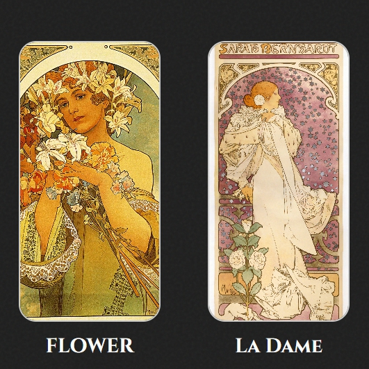

# 🎨 La Rose

Una galería digital inspirada en el arte de **Alphonse Mucha**, donde cada obra florece en silencio bajo el encanto del modernismo.  
El proyecto presenta una colección de ilustraciones acompañadas de textos poéticos originales que evocan la elegancia del estilo **Art Nouveau**.

---

## 🌺 Vista previa



---

## 🧩 Estructura

LaRose/
├── index.html # Página principal
├── style.css # Estilos del diseño
├── script.js # Configuración e interacción
├── plantilla.js # Plantilla de cada obra
├── assets/
│   ├── images/ # Arte
│   ├── fonts/ # Fuentes
│   └── svg/
└── README.md # Este archivo


---

## ⚙️ Configuración

1. Clona este repositorio:
   ```bash
   git clone https://github.com/Cristioro/la-rose-wallpaper.git
   cd la-rose-wallpaper
   ```

2. Abre `index.html` mediante **Wallpaper Engine** para visualizarlo.

3. Puedes editar los títulos y textos de cada obra directamente desde el Wallpaper Engine.

---

## ✨ Inspiración

> “La belleza no es solo un reflejo,
> es una forma de respirar el tiempo.”

Proyecto inspirado en las composiciones florales y femeninas de **Alphonse Mucha (1860–1939)**, maestro del *Art Nouveau*.

## 🌹 Autor

**Cristioro**
2025
🕊️ *Entre arte, código y silencio.*